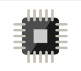
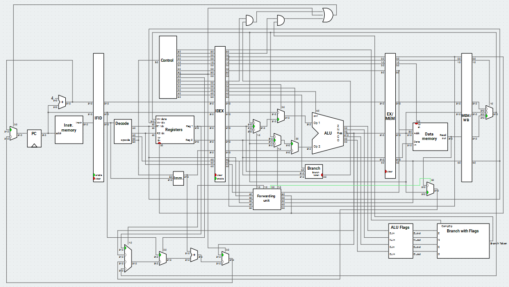
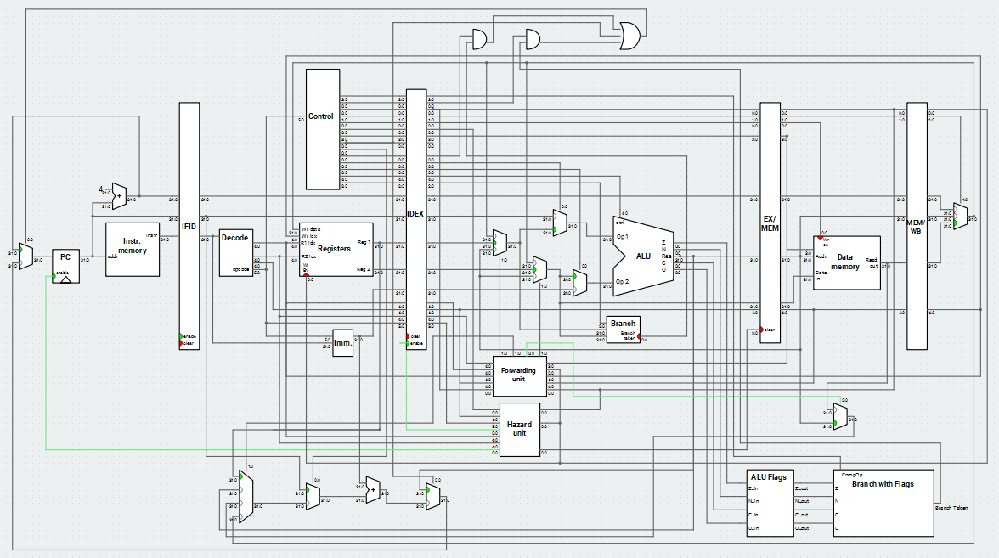

# Ripes

Ripes is a visual computer architecture simulator and assembly code editor built for the [RISC-V instruction set archtitecture](https://content.riscv.org/wp-content/uploads/2017/05/riscv-spec-v2.2.pdf).

## Table of Contents

 * [Downloading & Installation](#downloading-&-installation)
 * [Building](#building)
 * [Wiki](#wiki)
    * [RISC-V Introduction](#risc-v-introduction)
        * [Registers](#registers)
        * [Instruction Types](#instruction-types)
        * [Instructions](#instructions)
            * [RV32I Base Instruction Set](#rv32i-base-integer-instruction-set)
                * [R-type - register-register](#r-type---register-register)
                * [I-type - short immediates and loads](#i-type---short-immediates-and-loads)
                * [S-type - stores](#s-type---stores)
                * [B-type - conditional branches](#b-type---conditional-branches)
                * [U-type - long immediates](#u-type---long-immediates)
                * [J-type - unconditional jumps](#j-type---unconditional-jumps)
                * [BF-type - contidional branches with flags](#bf-type---contidional-branches-with-flags)
            * [RV32M  Standard Extension:](#rv32m-standard-extension)
            * [Pseudoinstructions](#pseudoinstructions)
        * [Asssembler Directives](#assembler-directives)
        * [Labels](#labels)
        * [System Calls](#system-calls)
    * [Ripes Introduction](#ripes-introduction)
        * [Editor Tab](#editor-tab)
        * [Processor Tab](#processor-tab)
        * [Controlling the Simulator](#controlling-the-simulator)
        * [Selecting Processor Models](#selecting-processor-models)
        * [Memory Tab](#memory-tab)
    * [Advanced Ripes](#advanced-ripes)
        * [Ripes Processors](#ripes-processors)
        * [Cache Simulation](#cache-simulation)
    * [RISC-V Assembly Program Examples](#risc-v-assembly-program-examples)
        * [RISC-V Assembly Programs](#risc-v-assembly-programs) 
        * [Computer Architecture Examples](#computer-architecture-examples)
            * [Data Hazard](#data-hazard)
            * [Control Hazard](#control-hazard)
* [References](#references)<br/><br/><br/><br/>

## Downloading & Installation

Prebuilt binaries are available for Windows through the [Releases Page](TODO:Link-Releases-Page)

For Windows, the C++ runtime library must be available (if not, a msvcp140.dll error will be produced). You most likely already have this installed, but if this is not the case, you download it [here](https://www.microsoft.com/en-us/download/details.aspx?id=48145).

## Building

Instead of using prebuilt releases, you may choose to build Ripes from source code yourself.

In order to do this, the following dependencies must be made available:

* A recent (5.10+) version of [Qt](https://www.qt.io/download) + Qt Charts (**not** bundled with Qt by default, but can be selected during Qt installation)
* [CMake](https://cmake.org/)

Then, Ripes can be checked out and built as a standard CMake project:

```
git clone --recursive https://github.com/metintasalperen/Ripes.git
cd Ripes/
cmake .
Unix:               Windows:
make                jom.exe / nmake.exe / ...
```
Note: You must have Qt available in your `CMAKE_PREFIX_PATH`. For further information on building Qt projects with CMake, refer to [Qt: Build with CMake](https://doc.qt.io/qt-5/cmake-manual.html).

## Wiki

Ripes is a graphical processor simulator and assembly code editor built for the [RISC-V instruction set archtitecture](https://content.riscv.org/wp-content/uploads/2017/05/riscv-spec-v2.2.pdf), suitable for teaching how assembly level code is executed on various microarchitectures.

* To get an introduction to RISC-V instruction set architecture, please refer to [RISC-V Introduction](#risc-v-introduction)
* To get an introduction to the main features of Ripes, please refer to [Ripes Introduction](#ripes-introduction)
* To get a more depth explanation of Ripes processors and cache simulations, please refer to [Advanced Ripes](#advanced-ripes)

## RISC-V Introduction

RISC-V is a modular instruction set architecture. It has multiple standard extensions that hardware may or may not include depending on the need of the application. Ripes supports RISC-V RV32IM instruction set.
- 32: 32-bit system
- I: mandatory base instructions
- M: multiplication instructions

Following sections aim to provide a brief explanation of RISC-V instructions and describe RISC-V assembly programming syntax. Adapted from the [official RISC-V Instruction Set Manual](https://content.riscv.org/wp-content/uploads/2017/05/riscv-spec-v2.2.pdf) and modified to only include features that are supported in Ripes.

### Registers

Registers are the most important part of any processor. RV32I base integer ISA includes 32 general purpose registers, named `x0` to `x31`. Program counter `PC` is seperated from these registers.

In practice, assembly programmer does not use this notation to refer to registers. In assembler, they are given standardized names as part of the RISC-V **application binary interface(ABI).** 

Register descriptions can be found below:

| Register | ABI Name | Description | Saver
| -------- | -------- | ----------- | -----
| x0 | zero | Hard-wired zero. Ignores writes | -
| x1 | ra | Return address for jumps | Caller
| x2 | sp | Stack pointer | Callee
| x3 | gp | Global pointer | -
| x4 | tp | Thread pointer | -
| x5 | t0 | Temporary register 0 | Caller
| x6 | t1 | Temporary register 1 | Caller
| x7 | t2 | Temporary register 2 | Caller
| x8 | s0 *or* fp | Saved register 0 *or* frame pointer | Callee
| x9 | s1 | Saved register 1 | Callee
| x10 | a0 | Function argument 0 / return value | Caller
| x11 | a1 | Function argument 1 / return value | Caller
| x12 | a2 | Function argument 2 | Caller 
| x13 | a3 | Function argument 3 | Caller
| x14 | a4 | Function argument 4 | Caller
| x15 | a5 | Function argument 5 | Caller
| x16 | a6 | Function argument 6 | Caller
| x17 | a7 | Function argument 7 | Caller
| x18 | s2 | Saved register 2 | Callee
| x19 | s3 | Saved register 3 | Callee
| x20 | s4 | Saved register 4 | Callee
| x21 | s5 | Saved register 5 | Callee
| x22 | s6 | Saved register 6 | Callee
| x23 | s7 | Saved register 7 | Callee
| x24 | s8 | Saved register 8 | Callee
| x25 | s9 | Saved register 9 | Callee
| x26 | s10 | Saved register 10 | Callee
| x27 | s11 | Saved register 11 | Callee
| x28 | t3 | Temporary register 3 | Caller
| x29 | t4 | Temporary register 4 | Caller
| x30 | t5 | Temporary register 5 | Caller
| x31 | t6 | Temporary register 6 | Caller

Saved registers `s0` to `s11` are preserved across function calls. So it is callee's job to preserve and restore the contents of these registers when returning from function call.

Temporary registers `t0` to `t6` and argument registers `a0` to `a7` are not preserved across function calls. So caller must save contents of these registers before a function call if contents of those registers are needed later.

### Instruction Types:

RISC-V instructions can be grouped into six types:

* R-type: register-register
* I-type: short immediates and loads
* S-type: stores
* B-type: conditional branches
* U-type: long immediates
* J-type: unconditional jumps
* BF-type: contiditonal branches with flags<sup>(*)</sup>

<sup>*</sup>Note that in order to support the RISC Processor used in [ITU Computer Architecture Lecture Notes](https://ninova.itu.edu.tr/tr/dersler/bilgisayar-bilisim-fakultesi/22/blg-322/ekkaynaklar/) a new type of instruction called conditional branches with flags (BF-type) is added to the Ripes. This type of instructions are **not** included at the original [RISC-V Instruction Set](https://content.riscv.org/wp-content/uploads/2017/05/riscv-spec-v2.2.pdf). 

Since there is no processor flags register in the RISC-V ISA, a flag register is added to Ripes in order to use BF-type instructions.

Flag register is a 4-bit register that contains:
* 1-bit zero flag - Z: **1** if ALU result is equal to zero, **0** otherwise.
* 1-bit negative flag - N: **1** if ALU result is negative, **0** otherwise.
* 1-bit carry flag - C: **1** if ALU operation cause a carry out, **0** otherwise.
* 1-bit overflow flag - O: **1** if ALU operation cause an overflow, **0** otherwise.

This register is updated accordingly after an ALU operation is performed. <br/><br/>

Prototypes of each instruction type can be found below:

<p align="center">
    
</p>

* **opcode:** The field that denotes the operation and format of an instruction. Always in bits 6:0.
* **funct3 & funct7:** Depending on the opcode, funct3 field (bit 14:12) and funct7 field (bits 31: 25) serve as extended opcode fields.
* **rs1:** The first register operand or source register 1. Always in bit positions 19:15.
* **rs2:** The second register operand or source register 2. Always in bit positions 24:20.
* **rd:** The destination register. Always in bit positions 11:7.
* **not care:** 3 bits positioned at 24:22 in BF-type instructions is not used so they are always 0.
* **Other operands:** 12-bit or 20-bit offsets. <br/><br/>

### Instructions:

#### RV32I Base Integer Instruction Set:

RV32I Base Integer Instructions implemented in Ripes and their syntax and descriptions can be found below:

#### R-type - register-register
* ADD : Add

    Operation: rd ← rs1 + rs2

    Syntax: add rd, rs1, rs2

    Description: Add register rs1 to register rs2 and store the result in the register rd.

    <!--Flag changes: Z: + , N: + , C: + , O: +-->

* SUB: Subtract

    Operation: rd ← rs1 - rs2

    Syntax: sub rd, rs1, rs2

    Description: Subtract register rs2 from register rs1 and store the result in the register rd.

    <!--Flag changes: Z: + , N: + , C: + , O: +-->

* SLL: Shift Left Logical

    Operation: rd ← rs1 << rs2

    Syntax: sll rd, rs1, rs2

    Description: Perform logical left shift on register rs1 by the shift amount held in the lower 5 bits of rs2 and store the result in the register rd.

    <!--Flag changes: Z: + , N: + , C: + , O: +-->

* SLT: Set Less Than

    Operation: rd ← 1 if rs1 < rs2
        
    &nbsp; &nbsp; &nbsp; &nbsp; &nbsp; &nbsp; &nbsp; &nbsp; &nbsp; rd ← 0 otherwise

    Syntax: slt rd, rs1, rs2

    Description: Write 1 to the register rd if signed value of register rs1 is less than signed value of register rs2. Write 0 otherwise.

* SLTU: Set Less Than Unsigned

    Operation: rd ← 1 if rs1 < rs2

    &nbsp; &nbsp; &nbsp; &nbsp; &nbsp; &nbsp; &nbsp; &nbsp; &nbsp; rd ← 0 otherwise

    Syntax: sltu rd, rs1, rs2

    Description: Write 1 to the register rd if unsigned value of register rs1 is less than unsigned value of register rs2. Write 0 otherwise.

* XOR: Exclusive OR Logical

    Operation: rd ← rs1 ⊕ rs2

    Syntax: xor rd, rs1, rs2

    Description: XOR (exclusive or) the register rs1 with the register rs2 and store the result in the register rd.

* SRL: Shift Right Logical

    Operation: rd ← rs1 >> rs2

     Syntax: srl rd, rs1, rs2

    Description: Perform logical right shift on register rs1 by the shift amount held in the lower 5 bits of rs2 and store the result in the register rd.

* SRA: Shift Right Arithmetic

    Operation: rd ← rs1 >> rs2

    Syntax: sra rd, rs1, rs2

    Description: Perfrom arithmetic right shift on register rs1 by the shift amount held in the lower 5 bits of rs2 and store the result in the register rd. <br/><br/><br/><br/><br/><br/>

* OR: OR Logical

    Operation: rd ← rs1 + rs2

    Syntax: or rd, rs1, rs2

    Description: OR the register rs1 with the register rs2 and store the result in the register rd.

* AND: AND Logical

    Operation: rd ← rs1.rs2

    Syntax: and rd, rs1, rs2

    Description: AND the register rs1 with the register rs2 and store the result in the register rd

#### I-type - short immediates and loads
* LB: Load Byte

    Operation: rd ← M[rs1 + 12-bit offset]

    Syntax: lb rd, offset(rs1)

    Description: Load 8-bits value from memory, specified by the effective address rs1 + sign-extended 12-bit offset, then sign-extend to 32-bits and store in the register rd.

* LH: Load Half Word

    Operation: rd ← M[rs1 + 12-bit offset]

    Syntax: lh rd, offset(rs1)

    Description: Load 16-bits value from memory, specified by the effective address rs1 + sign-extended 12-bit offset, then sign-extend to 32-bits and store in the register rd.

* LW: Load Word

    Operation: rd ← M[rs1 + 12-bit offset]

    Syntax: lw rd, offset(rs1)

    Description: Load 32-bits value from memory to the register rd, specified by the effective address rs1 + sign-extended 12-bit offset.

* LBU: Load Byte Unsigned

    Operation: rd ← M[rs1 + 12-bit offset]

    Syntax: lbu rd, offset(rs1)

    Description: Load 8-bits value from memory, specified by the effective address rs1 + sign-extended 12-bit offset, then zero-extend to 32-bits and store in the register rd.<br/><br/>

* LHU: Load Half Word Unsigned

    Operation: rd ← M[rs1 + 12-bit offset]

    Syntax: lhu rd, offset(rs1)

    Description: Load 16-bits value from memory, specified by the effective address rs1 + sign-extended 12-bit offset, then zero-extend to 32-bits and store in the register rd.

* ADDI: Add Immediate

    Operation: rd ← rs1 + 12-bit immediate

    Syntax: addi rd, rs1, immediate

    Description: Add register rs1 to sign-extended 12-bit immediate and store the result in the register rd.

* SLTI: Set Less Than Immediate

    Operation: rd ← 1 if rs1 < 12-bit immediate

    &nbsp; &nbsp; &nbsp; &nbsp; &nbsp; &nbsp; &nbsp; &nbsp; &nbsp; rd ← 0 otherwise

    Syntax: slti rd, rs1, immediate

    Description: Write 1 to the register rd if signed value of register rs1 is less than signed value of sign-extended 12-bit immediate. Write 0 otherwise.

* SLTIU: Set Less Than Immediate Unsigned

    Operation: rd ← 1 if rs1 < 12-bit immediate

    &nbsp; &nbsp; &nbsp; &nbsp; &nbsp; &nbsp; &nbsp; &nbsp; &nbsp; rd ← 0 otherwise

    Syntax: sltiu rd, rs1, immediate

    Description: Write 1 to the register rd if unsigned value of register rs1 is less than unsigned value of sign-extended 12-bit immediate. Write 0 otherwise.

* XORI: XOR Immediate

    Operation: rd ← rs1 ⊕ 12-bit immediate

    Syntax: xori rd, rs1, immediate

    Description: XOR the register rs1 with sign-extended 12-bit immediate and store the result in the register rd.<br/><br/><br/><br/><br/><br/><br/>

* ORI: OR Immediate

    Operation: rd ← rs1 + 12-bit immediate

    Syntax: ori rd, rs1, immediate

    Description: OR the register rs1 with sign-extended 12-bit immediate and store the result in the register rd.

* ANDI: AND Immediate

    Operation: rd ← rs1.12-bit immediate

    Syntax: andi rd, rs1, immediate

    Description: AND the register rs1 with sign-extended 12-bit immediate and store the result in the register rd.

* SLLI: Shift Left Logical Immediate

    Operation: rd ← rs1 << 12-bit immediate

    Syntax: slli rd, rs1, immediate

    Description: Perform logical left shift on register rs1 by the shift amount held in the lower 5 bits of 12-bit immediate and store the result in the register rd.

* SRLI: Shift Right Logical Immediate

    Operation: rd ← rs1 >> 12-bit immediate

    Syntax: srli rd, rs1, immediate

    Description: Perform logical right shift on register rs1 by the shift amount held in the lower 5 bits of 12-bit immediate and store the result in the register rd.

* SRAI: Shift Right Arithmetic Immediate

    Operation: rd ← rs1 >> 12-bit immediate

    Syntax: srli rd, rs1, immediate

    Description: Perform arithmetic right shift on register rs1 by the shift amount held in the lower 5 bits of 12-bit immediate and store the result in the register rd.

* JALR: Jump and Link Register

    Operation: rd ← pc + 4

    &nbsp; &nbsp; &nbsp; &nbsp; &nbsp; &nbsp; &nbsp; &nbsp; &nbsp; pc ← rs1 + 12-bit immediate<!--, then set LSB (least significant bit) of PC to 0-->

    Syntax: jalr rd, rs1, 12-bit immediate

    Description: Write the address of the next instruction (pc + 4) to the register rd. Add 12-bit signed immediate to register rs1 and store the result to pc.

#### S-type - stores
* SB: Store Byte

    Operation: M[rs1 + 12-bit offset] ← rs2

    Syntax: sb rs2, 0(rs1)

    Description: Load 8-bits value from low 8-bits of register rs2 to memory, specified by the effective address rs1 + sign-extended 12-bit offset.

* SH: Store Half Word

    Operation: M[rs1 + 12-bit offset] ← rs2

    Syntax: sh rs2, 0(rs1)

    Description: Load 16-bits value from low 16-bits of register rs2 to memory, specified by the effective address rs1 + sign-extended 12-bit offset.

* SW: Store Word

    Operation: M[rs1 + 12-bit offset] ← rs2

    Syntax: sw rs2, 0(rs1)

    Description: Load 32-bits value from register rs2 to memory, specified by the effective address rs1 + sign-extended 12-bit offset.

#### B-type - conditional branches
* BEQ: Branch If Equal

    Operation: pc ← pc + 12-bit immediate if rs1 = rs2

    &nbsp; &nbsp; &nbsp; &nbsp; &nbsp; &nbsp; &nbsp; &nbsp; &nbsp; pc ← pc + 4 otherwise

    Syntax: beq rs1, rs2, label

    Description: Compare register rs1 and register rs2, if they are equal branch to pc + 12-bit immediate.

* BNE: Branch If Not Equal

    Operation: pc ← pc + 12-bit immediate if rs1 != rs2

    &nbsp; &nbsp; &nbsp; &nbsp; &nbsp; &nbsp; &nbsp; &nbsp; &nbsp; pc ← pc + 4 otherwise

    Syntax: bne rs1, rs2, label

    Description: Compare register rs1 and register rs2, if they are not equal branch to pc + 12-bit immediate.<br/><br/><br/>

* BLT: Branch If Less Than

    Operation: pc ← pc + 12-bit immediate if rs1 < rs2

    &nbsp; &nbsp; &nbsp; &nbsp; &nbsp; &nbsp; &nbsp; &nbsp; &nbsp; pc ← pc + 4 otherwise

    Syntax: blt rs1, rs2, label

    Description: Compare signed value of register rs1 to signed value of register rs2, if rs1 is less than rs2 branch to pc + 12-bit immediate.

* BGE: Branch If Greater Than or Equal

    Operation: pc ← pc + 12-bit immediate if rs1 >= rs2

    &nbsp; &nbsp; &nbsp; &nbsp; &nbsp; &nbsp; &nbsp; &nbsp; &nbsp; pc ← pc + 4 otherwise

    Syntax: bge rs1, rs2, label

    Description: Compare signed value of register rs1 to signed value of register rs2, if rs1 is greater than or equal to rs2 branch to pc + 12-bit immediate.

* BLTU: Branch If Less Than Unsigned

    Operation: pc ← pc + 12-bit immediate if rs1 < rs2

    &nbsp; &nbsp; &nbsp; &nbsp; &nbsp; &nbsp; &nbsp; &nbsp; &nbsp; pc ← pc + 4 otherwise

    Syntax: bltu rs1, rs2, label

    Description: Compare unsigned value of register rs1 to unsigned value of register rs2, if rs1 is less than rs2 branch to pc + 12-bit immediate.

* BGEU: Branch If Greater Than or Equal Unsigned

    Operation: pc ← pc + 12-bit immediate if rs1 >= rs2

    &nbsp; &nbsp; &nbsp; &nbsp; &nbsp; &nbsp; &nbsp; &nbsp; &nbsp; pc ← pc + 4 otherwise

    Syntax: bgeu rs1, rs2, label

    Description: Compare unsigned value of register rs1 to unsigned value of register rs2, if rs1 is greater than or equal to rs2 branch to pc + 12-bit immediate.<br/><br/><br/><br/><br/><br/><br/><br/><br/><br/>

#### U-type - long immediates
* LUI: Load Upper Immediate

    Operation: rd[31:12] ← 20-bit immediate

    &nbsp; &nbsp; &nbsp; &nbsp; &nbsp; &nbsp; &nbsp; &nbsp; &nbsp; rd[11:0] ← 0

    Syntax: lui rd, 20-bit immediate

    Description: Place 20-bit immediate to the most significant 20 bits of register rd, fill rest of the register rd with 0.

* AUIPC: Add Upper Immediate to PC

    Operation: rd[31:12] ← 20-bit immediate

    &nbsp; &nbsp; &nbsp; &nbsp; &nbsp; &nbsp; &nbsp; &nbsp; &nbsp; rd[11:0] ← 0

    &nbsp; &nbsp; &nbsp; &nbsp; &nbsp; &nbsp; &nbsp; &nbsp; &nbsp; rd ← rd + pc

    Syntax: auipc rd, 20-bit immediate

    Description: Create 32-bit offset from the 20-bit upper immediate and fill the lowest 12-bit with zeros. Add this offset to the pc and store the result in register rd.

#### J-type - unconditional jumps
* JAL: Jump and Link

    Operation: rd ← pc + 4

    &nbsp; &nbsp; &nbsp; &nbsp; &nbsp; &nbsp; &nbsp; &nbsp; &nbsp; pc ← pc + sign-extended 20-bit immediate<!--, then set LSB (least significant bit) of PC to 0-->

    Syntax: jal rd, label

    Description: Write the address of the next instruction (pc + 4) to the register rd. Add 12-bit signed immediate to register rs1 and store the result to pc.

#### BF-type - contidional branches with flags
    
BF-type instructions check the flag values generated by the last ALU instruction.

Signed Comparisons:

* BLTF: Branch If Less Than - With Flag

    Operation: pc ← pc + 12-bit immediate if condition is true

    &nbsp; &nbsp; &nbsp; &nbsp; &nbsp; &nbsp; &nbsp; &nbsp; &nbsp; pc ← pc + 4 otherwise

    Syntax: bltf label

    Description: If NO'Z' + N'OZ' = 1 branch to pc + 12-bit immediate.

* BGTF: Branch If Greater Than - With Flag

    Operation: pc ← pc + 12-bit immediate if condition is true

    &nbsp; &nbsp; &nbsp; &nbsp; &nbsp; &nbsp; &nbsp; &nbsp; &nbsp; pc ← pc + 4 otherwise

    Syntax: bgtf label

    Description: If NOZ' + N'O'Z' = 1 branch to pc + 12-bit immediate.

* BLEF: Branch If Less Than or Equal - With Flag

    Operation: pc ← pc + 12-bit immediate if condition is true

    &nbsp; &nbsp; &nbsp; &nbsp; &nbsp; &nbsp; &nbsp; &nbsp; &nbsp; pc ← pc + 4 otherwise

    Syntax: blef label

    Description: If Z + NO' + N'O = 1 branch to pc + 12-bit immediate.

* BGEF: Branch If Greater Than or Equal - With Flag

    Operation: pc ← pc + 12-bit immediate if condition is true

    &nbsp; &nbsp; &nbsp; &nbsp; &nbsp; &nbsp; &nbsp; &nbsp; &nbsp; pc ← pc + 4 otherwise

    Syntax: bgef label

    Description: If Z + NO + N'O' = 1 branch to pc + 12-bit immediate.

* BEQF: Branch If Equal - With Flag

    Operation: pc ← pc + 12-bit immediate if condition is true

    &nbsp; &nbsp; &nbsp; &nbsp; &nbsp; &nbsp; &nbsp; &nbsp; &nbsp; pc ← pc + 4 otherwise

    Syntax: beqf label

    Description: If Z = 1 branch to pc + 12-bit immediate.

* BNEF: Branch If Not Equal - With Flag

    Operation: pc ← pc + 12-bit immediate if condition is true

    &nbsp; &nbsp; &nbsp; &nbsp; &nbsp; &nbsp; &nbsp; &nbsp; &nbsp; pc ← pc + 4 otherwise

    Syntax: bnef label

    Description: If Z' = 1 branch to pc + 12-bit immediate.<br/><br/><br/><br/><br/><br/>

Unsigned Comparisons:

* BLOF: Branch If Lower Than - With Flag

    Operation: pc ← pc + 12-bit immediate if condition is true

    &nbsp; &nbsp; &nbsp; &nbsp; &nbsp; &nbsp; &nbsp; &nbsp; &nbsp; pc ← pc + 4 otherwise

    Syntax: blof label

    Description: If CZ' = 1 branch to pc + 12-bit immediate.

* BHIF: Branch If Higher Than - With Flag

    Operation: pc ← pc + 12-bit immediate if condition is true

    &nbsp; &nbsp; &nbsp; &nbsp; &nbsp; &nbsp; &nbsp; &nbsp; &nbsp; pc ← pc + 4 otherwise

    Syntax: bhif label

    Description: If C'Z' = 1 branch to pc + 12-bit immediate.

* BLSF: Branch If Lower Than or Same - With Flag

    Operation: pc ← pc + 12-bit immediate if condition is true

    &nbsp; &nbsp; &nbsp; &nbsp; &nbsp; &nbsp; &nbsp; &nbsp; &nbsp; pc ← pc + 4 otherwise

    Syntax: blsf label

    Description: If C + Z = 1 branch to pc + 12-bit immediate.

* BHSF: Branch If Higher Than or Same - With Flag

    Operation: pc ← pc + 12-bit immediate if condition is true

    &nbsp; &nbsp; &nbsp; &nbsp; &nbsp; &nbsp; &nbsp; &nbsp; &nbsp; pc ← pc + 4 otherwise

    Syntax: bhsf label

    Description: If C' + Z = 1 branch to pc + 12-bit immediate.<br/><br/><br/><br/><br/><br/><br/><br/><br/><br/><br/><br/><br/><br/>

#### RV32M  Standard Extension:

RV32M Extension Instructions implemented in Ripes and their syntax and descriptions can be found below:

#### R-type - register-register

* MUL: Multiplication

    Operation: rd ← rs1 * rs2

    Syntax: mul rd, rs1, rs2

    Description: Multiply register rs1 and register rs2 and store the lower 32-bit of 64-bit result into the rd register.

* MULH: Multiplication High

    Operation: rd ← rs1 * rs2

    Syntax: mulh rd, rs1, rs2

    Description: Multiply signed value of register rs1 and signed value of register rs2 and store the upper 32-bit of 64-bit result into the rd register.

* MULHU: Multiplication High Unsigned

    Operation: rd ← rs1 * rs2

    Syntax: mulhu rd, rs1, rs2

    Description: Multiply unsigned value of register rs1 and unsigned value of register rs2 and store the upper 32-bit of 64-bit result into the rd register.

* MULHSU: Multiplication High Signed Unsigned

    Operation: rd ← rs1 * rs2

    Syntax: mulhsu rd, rs1, rs2

    Description: Multiply signed value of register rs1 and unsigned value of register rs2 and store the upper 32-bit of 64-bit result into the rd register.

* DIV: Division

    Operation: rd ← rs1 / rs2

    Syntax: div rd, rs1, rs2

    Description: Divide signed value of register rs1 to signed value of register rs2 and store the result to the rd register.<br/><br/><br/><br/>

* DIVU: Division Unsigned

    Operation: rd ← rs1 / rs2

    Syntax: divu rd, rs1, rs2

    Description: Divide unsigned value of register rs1 to unsigned value of register rs2 and store the result to the rd register.

* REM: Remainder

    Operation: rd ← rs1 % rs2

    Syntax: rem rd, rs1, rs2

    Description: Divide signed value of register rs1 to signed value of register rs2 and store the remainder to the rd register.

* REMU: Remainder Unsigned

    Operation: rd ← rs1 % rs2

    Syntax: remu rd, rs1, rs2

    Description: Divide unsigned value of register rs1 to unsigned value of register rs2 and store the remainder to the rd register.


#### Pseudoinstructions:

Since assembly language is an interface to higher-level software, the
assembler can also treat common variations of machine language
instructions as if they were instructions in their own right. The
hardware need not implement these instructions; however, their
appearance in assembly language simplifies translation and
programming. Such instructions are called pseudoinstructions and
assembler of Ripes support some of them.

Supported pseudoinstructions and their translation to the base instructions
can be found at the table below.

| Pseudoinstruction | Base Instruction(s) | Meaning |
| ----------------- | ------------------- | ------- |
nop | addi x0, x0, 0 | No operation
la rd, symbol | auipc rd, upper 20-bit of (symbol - pc) <br/> addi rd, rd, lower 12-bit of (symbol - pc) | Load absolute address
li rd, immediate | lui rd, upper 20-bit of immediate <br/> addi rd, rd, lower 12-bit of immediate | Load immediate
mv rd, rs | addi rd, rs, 0 | Copy register
not rd, rs | xori rd, rs, -1 | One's complement
neg rd, rs | sub rd, x0, rs | Two's complement
seqz rd, rs | sltiu rd, rs, 1 | Set rd if rs = zero
snez rd, rs | sltu rd, x0, rs | Set rd if rs != zero
sltz rd, rs | slt rd, rs, x0 | Set rd if rs < zero
sgtz rd, rs | slt rd, x0, rs | Set rd if rs > zero
beqz rs, label | beq rs, x0, label | Branch to label if rs = zero
bnez rs, label | bne rs, x0, label | Branch to label if rs != zero
blez rs, label | bge x0, rs, label | Branch to label if rs <= zero
bgez rs, label | bge rs, x0, label | Branch to label if rs >= zero
bltz rs, label | blt rs, x0, label | Branch to label if rs < zero
bgtz rs, label | blt x0, rs, label | Branch to label if rs > zero
bgt rs, rt, label | blt rt, rs, label | Branch to label if rs > rt
ble rs, rt, label | bge rt, rs, label | Branch to label if rs <= rt
bgtu rs, rt, label | bltu rt, rs, label | Branch to label if rs > rt, unsigned
bleu rs, rt, label | bgeu rt, rs, label | Branch to label if rs <= rt, unsigned
j label | jal x0, label | Jump
jal label | jal x1, label | Jump and link
jr rs | jalr x0, rs, 0 | Jump register
jalr rs | jalr x1, rs, 0 | Jump and link register
ret | jalr x0, x1, 0 | Return from subroutine
call offset | auipc x6, upper 20-bit of offset <br/> jalr x1, x6, lower 12-bit of offset | Call far-away subroutine
cmp rs, rt | sub x0, rs, rt | Subtract rs from rt, set flags accordingly and discard the result

<br/><br/><br/><br/><br/><br/><br/><br/><br/>

### Assembler Directives:

The following table lists assembler directives:

Directive | Arguments | Description
--------- | --------- | -----------
.text | | emit .text section (if not present) and make current
.data | | emit .data section (if not present) and make current
.string | "string" | emit string
.asciz | "string" | emit string (alias for .string)
.byte | expression [, expression]* | 8-bit comma separated words
.2byte | expression [, expression]* | 16-bit comma separated words
.half | expression [, expression]* | 16-bit comma separated words
.short | expression [, expression]* | 16-bit comma separated words
.4byte | expression [, expression]* | 32-bit comma separated words
.word | expression [, expression]* | 32-bit comma separated words
.long | expression [, expression]* | 32-bit comma separated words
.zero | integer | emit $integer zero-valued bytes

### Labels:

Text labels are used as branch, unconditional jump targets and symbol offsets. Text labels are added to the symbol table of the compiled module.

```
label:
    nop
    nop
    nop
    j label
```

<br/><br/><br/><br/><br/><br/><br/><br/><br/><br/>

### System Calls:

All supported system calls for your version of Ripes is described in the `Help->System Calls` menu, within the application.

All supported system calls can be found below:

<p align="center">
     
</p>

Example Usage:

Printing to Console

```
.data
str: .string "abc"

.text
li a0, 42
li a7, 1
ecall       # Prints "42" to console

li a7, 11
ecall       # Prints "*" to console (ASCII(42) = '*')

la a0, str
li a7, 4
ecall       # Prints "abc" to console
```

Stopping the Simulator

```
.text
li a0, 10
ecall
# Following instructions will not get executed
li a1, 1
li a2, 1
li a3, 1
```

<br/><br/>

## Ripes Introduction

The following sections serve as an introduction to the main features of Ripes.

### Editor Tab

<p align="center">
    
</p>

The editor tab shows two code segments. On the left hand side, it is possible to write an assembly program written using the RISC-V RV32(I/M) instruction sets. Whenever any edits are performed in this assembly program - and no syntax errors are found - the assembly code will automatically be assembled and inserted into the simulator.

Next, on the right hand side a second code view is displayed. This is a non-interactive view of the current program in its assembled state. The assembled program may be viewed as either disassembled RISC-V instructions, or as the raw binary code. The blue sidebar of the right-hand view may be clicked on to set a breakpoint at the desired address.

Ripes is bundled with various examples of RISC-V assembly programs, which can be found under the `File->Load Examples` menu. Or you can load your own custom program under the `File->Load Program`.

An example program can be found below: Loading a value from memory and incrementing it.

```
.data
w: .word 0x1234

.text
lw      a0, w
addi    a0, a0, 1
```

With a program ready to be simulated, we can move on to the *Processor Tab*

<br/><br/><br/><br/><br/><br/><br/><br/><br/><br/><br/>

### Processor Tab

<p align="center">
    
</p>

The processor tab is where Ripes displays its view of the currently selected processor, as well as any additional information relevant to the execution. Apart from the processor view, the processor tab contains the following views:

1. **Registers**: A list of all registers of the processor. Register values may be edited through clicking on the value of the given register. Editing a register value is immediately reflected in the processor circuit. The most recently modified register is highlighted with a yellow background.

2. **Instruction memory:** A view into the current program loaded in the simulator.
BP: Breakpoints, click to toggle. Any breakpoint set in the editor tab will be reflected here.
PC: The address of the given instruction
Stage: Lists the stage(s) that is currently executing the given instruction
Instruction: Disassembled instruction

3. **Statistics:** Various statistics based on the cycle count and current number of retired instructions.

4. **Output:** Any output through an `ecall` print function will be displayed here.

<br/><br/><br/><br/><br/><br/><br/><br/>

### Processor View

<p align="center">
    
</p>

Processor models in Ripes communicate the current state of the datapath through various visual means, such as

* Multiplexers indicate the currently selected input signal by highlighting an input port with a green dot.
* Various components contains indicators to communicate whenever i.e. a register is clocked, a branch is taken, etc.
* Port value changes are reflected through signal wires:
    * *Boolean (1-bit signals):* Boolean signals will always indicate whether a signal is high (1) when a wire is green, and low (0) when a wire is grey.
    * Other signals, when modified, will briefly flash green to indicate that the value was modified.

The processor view may be zoomed by performing a `ctrl+scroll` operation (`cmd+scroll` on OSX).

Clicking a wire highlights the entirety of the wire. This is useful when trying to deduce how a signal is routed through the datapath in some of the more complex layouts.

Given that Ripes simulates the entire datapath of a processor, it is possible to investigate the value of any signal, at any point in time.

<br/><br/><br/><br/><br/>

1. Hover over any port in the processor view. This will display the name of the port, as well as the current value of the port.

<p align="center">
    
</p>

2. Press the Display signal values button. This will display the output values of all output ports in the design. Alternatively, right click on any port and press "show value" to display its label. If a port's value label has been made visible, it is possible to change the radix of the displayed value through right-clicking the port label.

<p align="center">
    
</p>

### Controlling the Simulator

The toolbar within Ripes contains all of the relevant actions for controlling the simulator.

<p align="center">
    
</p>

* **Select Processor:** Opens the processor selection dialog (for details, refer to section below).
* **Reset:** Resets the processor, setting the program counter to the entry point of the current program, and resets the simulator memory.
Reverse: Undo's a clock-cycle.
* **Clock:** Clocks all memory elements in the circuit and updates the state of the circuit.
* **Auto-clock:** Clocks the circuit with the given frequency specified by the auto-clock interval. Auto-clocking will stop once a breakpoint is hit.
* **Run:** Executes the simulator without performing GUI updates, to be as fast as possible. Any print ecall functions will still be printed to the output console. Running will stop once a breakpoint is hit or an exit ecall has been performed.
* **Display signal values:** Toggles displaying all output port values of the processor.
* **Show stage table:** Displays a chart showing which instructions resided in which pipeline stage(s) for each cycle. Stalled stages are indicated with a '-' value. Note: Stage information is not recorded while executing the processor through the Run option.

<p align="center">
    
</P>

While executing the program loaded earlier, we may observe that, in cycle 4, a load-use dependency arises between the 2nd and 3rd instruction. This results in the ID stage being stalled for one clock cycle, whilst the load is being performed. Pipeline stalls (due to hazards) and flushes (due to control flow) will be indicated above a pipeline stage as nop instructions highlighted in red.

<p align="center">
    
</P>

### Selecting Processor Models

<p align="center">
    
</P>

Through providing multiple processor models, Ripes provides the ability to investigate how different microarchitectures affect program execution. The set of processor models aims to address each level of added complexity when going from a single cycle processor to a fully functioning, in-order pipelined processor. Ripes provides the following processor models:

* **RISC-V Single Cycle Processor**
* **RISC-V 5-Stage Processor w/o Forwarding or Hazard Detection**
* **RISC-V 5-Stage Processor w/o Hazard Detection**
* **RISC-V 5-Stage Processor**

Opening the processor selection dialog, one may choose and configure the current processor:

<p align="center">
    
</P>

On the left hand side, each available processor is listed and it is possible to specify register initializations. These initialization values will be applied to the registers each time the processor is reset.

As an example processor selection, the following image shows the extended layout of the *RISC-V 5-stage Processor*:

<p align="center">
    
</p>

### Memory Tab

<p align="center">
    
</p>

The memory tab provides a view into the entire addressable address space of the processor, as well as access to Ripes' cache simulator.

Navigating the memory may be done as follows:

* **Scrolling** the memory view
* **Go to register** will scroll the memory view to the value currently present in the selected register
* **Go to section** will scroll the memory view to the address of the given section value in memory (i.e. the instruction memory .text segment, the static data .data segment etc). Furthermore, a custom address may be specified through the "Address..." option.

Whenever the processor is reset, all memory written during program execution will be reset to its initial state.

<!--This concludes the introduction to Ripes and its main features. Below more in-depth explanation of Ripes features can be found.-->

## Advanced Ripes

The sections below aim to explain included Ripes processor models and cache simulation.

### Ripes Processors

Through providing multiple processor models, Ripes provides the ability to investigate how different microarchitectures affect program execution. The set of processor models aims to address each level of added complexity when going from a single cycle processor to a fully functioning, in-order pipelined processor. Ripes provides the following processor models:

* **RISC-V Single Cycle Processor**
* **RISC-V 5-Stage Processor w/o Forwarding or Hazard Detection**
* **RISC-V 5-Stage Processor w/o Hazard Detection**
* **RISC-V 5-Stage Processor**

Ripes have 3 different processor that implements a 5-stage in-order pipeline. A brief explanation of the pipeline can be found below:

1. Instruction Fetch (IF):

    Get instruction from instruction memory, incerement PC. (PC ← PC + 4 because length of RISC-V instructions are 4 bytes).

2. Instruction Decode (ID):

    Decode instruction and generate necessary control signals. Read operands from register file.

    If decoded instruction is unconditional jump, compute branch address and load PC with branch address.

3. Execute (EX):

    Perform ALU operation. Compute conditional branch target and decide whether branch will be taken or not. If branch taken decided, load PC with branch target address.

4. Memory (MEM):

    Access to memory if needed (Only load and store instructions need to access memory).

5. Write Back (WB):

    Write results to register file.

#### RISC-V Single Cycle Processor

First and most basic processor included in Ripes is **RISC-V Single Cycle Processor** that has no pipelining. 

Processor view of this processor can be found below.

<p align="center">
    
</p>

#### RISC-V 5-Stage Processor w/o Forwarding or Hazard Detection

The most simple Ripes processor that implements pipeline. However this processor does not have neither forwarding nor hazard detection capabilities. Therefore it is programmer's job to implement necessary no operation stalls to make sure program executed correctly in the processor.

Processor view of this processor can be found below.

<p align="center">
    
</p>

#### RISC-V 5-Stage-Processor w/o Hazard Detection

In order to decrease stalling time, a direct connection from EX/MEM and MEM/WB registers to the inputs of the ALU are established. Even though this solves most of the data hazards, there are still some that cannot be solved with forwarding. Therefore it is programmer's job to implement necessary no operation stalls to make sure program executed correctly in the processor.

Processor view of this processor can be found below.

<p align="center">
    
</p>

#### RISC-V 5-Stage Processor

This processor implements both forwarding and hazard detection units so processor does all the necessary forwarding and hazard detection stalls. Therefore programmer does not have to worry about hazards when writing a program.

Processor view of this processor can be found below.

<p align="center">
    
</p>

### Cache Simulation
Ripes includes cache simulation. The cache simulator simulates L1D (data) and L1I (instruction) caches, wherein it is possible to configure the layout and behavior of each cache type. Given this, we are able to analyse the cache performance of our programs to see how different cache designs interact with the memory access patterns which our programs exhibit.

Before getting started, here are some general notes on cache simulation in Ripes:

* It is **recommended** to use the single-cycle processor for cache simulation, given that:
    * If simulating with the pipelined processor models, it may happen that we are stalling a stage which is currently reading from memory. If a stage is stalled, each stalled cycle will count as an additional memory access. This is implementation-specific behavior and as such may or may not be similar to other computing systems. Such behavior is avoided with the single-cycle model.
    * The single-cycle processor model has a significantly faster execution rate as compared to the pipelined processor models.
* The processor models do not access the cache simulator when accessing memory. Instead, the cache simulator hooks into a processor model and analyses memory accesses within each clock cycle. Then, these memory accesses are used as a trace for performing our cache simulation. The implications of this are: <br/><br/><br/>
    * Ripes does not simulate cache access latency. As such, Ripes does not provide any estimations of actual CPU execution time, but can solely provide insight into factors such as miss, hit and writeback rates.
    * Dirty cache lines (when the cache is configured in write-back mode) will still be visible in the memory view. In other words, words are always written through to main memory, even if the cache is configured in write-back mode<sup>[1](#f1)</sup>.
    
<p id="f1">1: This would be an obvious issue if Ripes was to simulate a multiprocessor system. However, given that this is not the case, and that cache latency is not simulated, this will not have any effect on cache access statistics nor execution semantics.</p> 

#### The Cache

#### Cache Configuration

<p align="center">
    
</p>

The cache is configurable through the following options:
* **Ways:** Associativity specification. Specified in a power of two (ie. a "two-way set associative cache" will have `ways=1 (2^1 = 2 ways)` whereas a "direct mapped cache" will have `ways=0 (2^0 = 1 way))`.
* **Lines:** Number of cache lines. The number of cache lines will define the size of the `index` used to index within the cache. Specified in a power of two.
* **Blocks:** Number of blocks within each cache line. The number of blocks will define the size of the `block index` used to select a block within a cache line. Specified in a power of two.
* **Wr. hit/Wr. miss:** Cache write policies. Please refer to [this Wikipedia article](https://en.wikipedia.org/wiki/Cache_(computing)#Writing_policies) for further info.
* **Repl. policy:** Cache replacement policies. Please refer to [this Wikipedia article](https://en.wikipedia.org/wiki/Cache_replacement_policies) for further info.
Furthermore, a variety of presets, which reflect typical cache design points, are made available.
On the right-hand side of the configuration view we find the statistics view. This view presents access statistics for the current cycle. Furthermore, theoretical cache size (in bits) is calculated. To see a breakdown of the components of this calculation, press the  button.

Finally, a **cache indexing breakdown** is provided. This illustration displays the bits within a memory access address which is used for indexing into the cache; respectively the cache line index, the block index and the tag. This illustration is updating accordingly to the current cache configuration. <br/><br/><br/><br/><br/><br/>

#### The Cache View

Based on the current cache configuration, a visualization of the current state of the cache is provided.

<p align="center">
    
</p>

The cache is drawn as a table wherein rows are defined as:
* **Cache lines** are delimited with solid lines. The indices (index column) represents the index of each cache line.
* **Cache ways** are contained within a cache line. Ways which map within the same cache line are delimited with **dashed** lines.

Commonly, a set-associative cache will be drawn as separate tables for each way. This representation is equivalent with the representation used in Ripes, as follows:

<p align="center">
    
</p>

Columns within the cache view are defined as:

* **V**: Valid bit. Whether the cache way contains valid data.
* **D**: Dirty bit. Whether the cache way contains dirty data (the cache way was written to, in write-back mode).
* **LRU**: Visible when `ways > 0` and `Repl. policy = LRU`. A value which was just accessed will have LRU = 0, and a value which is about to be evicted will have an LRU value of `LRU = 2^(ways) - 1`.
* **Tag**: Current tag of the cached way.
* **Block #**: Cached data.

The cache view may be interacted with as follows:

* Hovering over a block will display the physical address of the cached value
* Clicking a block will move the memory view to the corresponding physical address of the cached value.
* The cache view may be zoomed by performing a ctrl+scroll operation (cmd+scroll on OSX).

When the cache is indexed, the corresponding line row and block column will be highlighted in yellow. The intersection of these corresponds to all the cells which may contain the cached value. Hence, for a direct mapped cache, only 1 cell will be in the intersection whereas for an N-way cache, N cells will be highlighted. In the 4-way set associative cache picture above, we see that 4 cells are highlighted. A cell being highlighted as green indicates a cache hit, whilst red indicates a cache miss. A cell being highlighted in blue indicates that the value is dirty (with write-hit policy "write-back").

#### Cache Access Statistics

Pressing the  icon will bring up the cache data plot window.

<p align="center">
     
</p> <br/><br/>

Here, it is possibly to plot cache access data gathered during program execution. The recorded data is:
* **Writes:** # of times the cache was accessed through a write
* **Reads:** # of times the cache was accessed through a read
* **Hits:** # of times a cache access (read or write) was a hit
* **Misses:** # of times a cache access (read or write) was a miss
* **Writebacks:** # of times a cache line was written back to memory
* **Total accesses:** Effectively reads+writes or hits+misses

Two plot types are available:

* **Ratio:** Compares the ratio of two variable types throughout execution. Examples are:
    * **Hit rate:** select Hits/Total accesses
    * **Miss rate:** select Misses/Total accesses
* **Stacked:** Displays the cumulative value of each access type over the time of the execution.

The cache plot window furthermore provides the following actions:

* : Copy plot data to clipboard
* : Save plot to file


## RISC-V Assembly Program Examples

### RISC-V Assembly Programs

Ripes contains various RISC-V assembly program examples that can be found at `File->Load Examples`. These example programs are:

* Complex Multiplication
* Factorial - Iterative
* Factorial - Recursive
* Russian Peasant Multiplication
* Sorting

### Computer Architecture Examples

#### Data Hazard

There are three types of data hazards:
* "Read after write (RAW)" or "true dependency": 

    An instruction modifies a register or memory location, and a succeeding instruction reads the data in that memory or register location.

    A data hazard occurs if the read takes place before the write operation is complete.

* "Write after read (WAR)" or "antidependency": 

    An instruction reads a register or memory location, and a succeeding instruction writes to the location.

    A data hazard occurs if the write operation completes before the read operation takes place.

* "Write after write (WAW)" or "output dependency":

    Two instructions both write to the same location.

    A data hazard occurs if the write operations take place in the reverse order of the intended sequence.


In this simulator, only "Read after write (RAW)" typed data hazards can occur because of the way the pipeline implemented. (reads in ID stage, writes in WB stage)

`File->Load Examples->Computer Architecture->Data Hazard` folder has examples that demonstrate "Read after write (RAW)" typed data hazards. There are several solutions to prevent data hazards:

A) Stalling / Inserting nop Instructions

The instruction that causes the hazard is delayed (not fetched) until the conflict is solved.

This can be accomplished by using an additional hardware to stall the Instruction Fetch (IF) stage of the pipeline when a hazard is detected, or by a compiler that inserts nop instructions between instructions that cause the data hazard.

Example 1:

| Instructions/Clock Cycles |  CC 1 | CC 2 | CC 3 | CC 4 | CC 5 | CC 6 | CC 7 | CC 8 |
| - | - | - | - | - | - | - | - | - |
| add **t2**, t0, t1 | IF | ID | EX | MEM | WB |
| sub t4, **t2**, t3 | | IF | - | - | ID | EX | MEM | WB |

Data conflict is detected. IF/ID.Rs1 (t2 register) = ID/EX.Rd (t2 register)

Therefore pipeline is stalled to prevent data hazard. 2 clock-cycles delay.

\*Note: In this simulator, register file can be accessed in the same cycle for both reading and writing.
Data can be written in the first half of the cycle (rising edge) and read in the second half (falling edge). 
This method reduces the delay time from 3 cycles to 2 cycles.

Example 2:

| Instructions/Clock Cycles |  CC 1 | CC 2 | CC 3 | CC 4 | CC 5 | CC 6 | CC 7 | CC 8 |
| - | - | - | - | - | - | - | - | - |
| add **t2**, t0, t1 | IF | ID | EX | MEM | WB |
| nop | | IF | ID | EX | MEM | WB |
| nop | | | IF | ID | EX | MEM | WB |
| sub t4, **t2**, t3 | | | | IF | ID | EX | MEM | WB |

Effect of this example is similar to stalling the pipeline shown in Example 1.

Since nop is a machine language instruction of the processor, it is processed in the pipeline just like any other instructions. <br/><br/><br/>

By selecting `5-Stage Processor w/o forwarding and hazard detection` and loading `File->Load Examples->Computer Architecture->Data Hazard->Data Hazard #1` "Read after write (RAW)" data hazard can be observed.

Data Hazard #1:
```
.text
start:
li      t0, 3           # t0 = 3
li      t1, 2           # t1 = 2
li      t2, 0           # t2 = 0
li      t3, 4           # t3 = 4
j       data_hazard     # branch unconditionally to data_hazard

data_hazard:
add     t2, t0, t1      # t2 = t0 + t1
sub     t4, t2, t3      # t4 = t2 + t3
```

By looking at the program above, at the end, we expect t4 to be equal to 1. 

However when we execute the program, we see that t4 is equal to -4. Because sub instruction reads t2 before it has been updated by add instruction.

In order to prevent this data hazard, we need to add two nop instructions between add and sub instructions. New program then becomes:

Data Hazard #1:
```
.text
start:
li      t0, 3           # t0 = 3
li      t1, 2           # t1 = 2
li      t2, 0           # t2 = 0
li      t3, 4           # t3 = 4
j       data_hazard     # branch unconditionally to data_hazard

data_hazard:
add     t2, t0, t1      # t2 = t0 + t1
nop
nop
sub     t4, t2, t3      # t4 = t2 + t3
```

<br/><br/><br/><br/><br/>

B) Operand Forwarding (Bypassing)

Direct connections are established between EX/MEM and MEM/WB registers and the inputs of the ALU.

* Operand forwarding from EX/MEM to ALU

If forwarding unit detects that the destination of the previous ALU operation is the same register as the source of the current ALU operation, control logic of forwarding unit will select the forwarded result as the ALU input, rather than the value from the register.

Example:

| Instructions/Clock Cycles |  CC 1 | CC 2 | CC 3 | CC 4 | CC 5 | CC 6 | CC 7 | CC 8 |
| - | - | - | - | - | - | - | - | - |
| add **t2**, t0, t1 | IF | ID | EX | MEM | WB |
| sub t4, **t2**, t3 | | IF | ID | EX | MEM | WB |

Forwarding unit will select the output of the previous ALU operation (add t2, t0, t1) as the input, not the value that has been read in the ID stage.

Since it is possible to solve this conflict by forwarding, it is not necessary to stall the pipeline. Therefore performance does not drop.

By selecting `5-Stage Processor` and loading `File->Load Examples->Computer Architecture->Data Hazard->Data Hazard #1` Operand forwarding from EX/MEM to ALU can be observed.

Data Hazard #1:
```
.text
start:
li      t0, 3           # t0 = 3
li      t1, 2           # t1 = 2
li      t2, 0           # t2 = 0
li      t3, 4           # t3 = 4
j       data_hazard     # branch unconditionally to data_hazard

data_hazard:
add     t2, t0, t1      # t2 = t0 + t1
sub     t4, t2, t3      # t4 = t2 + t3
```

<p align="center">
    
</p>

As seen from the picture above, result of the previous ALU operation (add t2, t0, t1) is forwarded to the first input of the ALU. Forwarding Unit generates the control signals needed by multiplexers.

* Operand Forwarding from MEM/WB to ALU

Load operations may also cause data hazards.

To decrease the waiting time cause by load-use hazards, a direct connection can be established between MEM/WB register and the inputs of the ALU. However, one clock cycle delay is still needed.

By selecting `5-Stage Processor` and loading `File->Load Examples->Computer Architecture->Data Hazard->Load-Use Data Hazard` Operand forwarding from MEM/WB to ALU can be observed.

```
.data
x: 		.word 3

.text
start:
la		t0, x
li		t1, 2
j		load-use-hazard

load-use-hazard:
lw		t2, 0(t0)
add		t0, t1, t2
```

<p align="center">
    
</p>

As seen from the picture above, once Hazard Unit detects a load-use hazard, it stalls the pipeline 1 clock cycle by clearing ID/EX register (equivalent to nop instruction) and disabling the IF/ID and PC registers.

<p align="center">
    
</p>

Then, once the value is read from memory it is forwarded to the inputs of the ALU. Forwarding Unit generates the control signals needed by multiplexers.<br/><br/><br/>

C) Optimized Solution

Compiler rearranges the program and moves certain instructions (if possible) between the instructions that cause the data hazard.

This rearrangement must not change the algorithm or cause new conflicts.

Example:

A program that has several data hazards can be found below. Data hazards in this program are solved by inserting nop operations between instructions.

```
# a = b + e
# c = b + f

.data
a:		.word	0
b:		.word	4
c:		.word	0
e:		.word	2
f:		.word	-1

# Data conflicts solved by insterting no operation instructions
.text
main:
		li	t0, 0x10000000
		nop
		nop
		lw	t1, 4(t0)	# load b to t1
		lw	t2, 12(t0)	# load e to t2
		nop
		nop
		add	t3, t1, t2	# t3 = b + e
		nop
		nop
		sw	t3, 0(t0)	# save t3 to a
		lw	t4, 16(t0)	# load f to t4
		nop
		nop
		add	t5, t1, t4	# t5 = b + f
		nop
		nop
		sw	t5, 8(t0)	# save t5 to c
       
# total = 18 instructions
# required clock cycle = 22
```

This program has 18 instructions and requires 22 clock cycles to complete. A compiler may change the arrangement of the instructions instead of adding nop instructions to resolve data conflicts.

Same program with rearranged instructions can be found below. Some of the data hazards in this program are solved by instruction rearrangements.

```
# a = b + e
# c = b + f

.data
a:		.word	0
b:		.word	4
c:		.word	0
e:		.word	2
f:		.word	-1

# Instead of placing no operation instructions to any data hazard. Compiler may rearrange
# the sequence of the instructions that cause data hazards.
.text
main:
		li	t0, 0x10000000
		nop
		nop
		lw	t1, 4(t0)	# load b to t1
		lw	t2, 12(t0)	# load e to t2
		lw	t4, 16(t0)	# load f to t4
		nop
		add	t3, t1, t2	# t3 = b + e
		add	t5, t1, t4	# t5 = b + f
		nop
		sw	t3, 0(t0)	# save t3 to a
		sw	t5, 8(t0)	# save t5 to c

# total = 12 instructions
# required clock cycle = 16
```

Same program now has 12 instructions and requires 16 clock cycles to complete. Performance is improved.

#### Control Hazard

In Ripes, branch target address calculation and branch decision are made in EX stage. 

While branch instruction is in the pipeline, next instructions in sequence are fetched into the pipeline.

However, if the branch is taken, these instructions should be skipped.

In this case IF/ID and ID/EX registers are cleared (emptying the pipeline).

<br/><br/><br/><br/><br/>

Example 1 - Conditional Branch Taken:

By selecting `5-Stage Processor` and loading `File->Load Examples->Computer Architecture->Control Hazard->Conditional Branch - Taken`, conditional branch hazard when branch is taken can be observed.

```
.data
result: .word	0

.text
main:
		li		t0, 5			# t0 = 5
		li		t1, 4			# t1 = 4
		cmp		t0, t1			# set ALU flags for t0 - t1
		bgtf	br-taken		# branch to "br-taken" if t0 > t1 (NOZ' + N'O'Z' = 1)
		add		t1, t0, t0		# These instructions are
		add		t3, t0, t1		# emptied from pipeline 
		j		exit			# by hardware

br-taken:
		la		t2, result
		sw		t1, 0(t2)

exit:
		li a7, 10
		ecall
```

| Instructions | | | | | | | | | |
| - | - | - | - | - | - | - | - | - | - |
| cmp t0, t1 | IF | ID | EX | MEM | WB |
| bgtf br-taken | | IF | ID | EX | MEM | WB |
| (skipped) add t1, t0, t0 | | | IF | ID | EX | MEM | WB |
| (skipped) add t3, t0, t1 | | | | IF | ID | EX | MEM | WB |
| (br target) la t2, result | | | | | IF | ID | EX | MEM | WB |

Target address is calculated at EX stage and decision is made as "branch taken". Target address is sent from EX stage to IF stage. Target instruction of bgtf is fetched.

<br/><br/><br/><br/><br/><br/><br/>

Example 2 - Conditional Branch Not Taken:

By selecting `5-Stage Processor` and loading `File->Load Examples->Computer Architecture->Control Hazard->Conditional Branch - Not Taken`, conditional branch hazard when branch is not taken can be observed.

```
.data
result: .word	0

.text
main:
		li		t0, 5			# t0 = 5
		li		t1, 4			# t1 = 4
		cmp		t0, t1			# set ALU flags for t0 - t1
		bltf	br-taken		# branch to "br-taken" if t0 < t1 (NO'Z' + N'OZ' = 1)
		add		t1, t0, t0		# These instructions are
		add		t3, t0, t1		# emptied from pipeline 
		j		exit			# by hardware

br-taken:
		la		t2, result
		sw		t1, 0(t2)

exit:
		li a7, 10
		ecall
```

| Instructions | | | | | | | | | |
| - | - | - | - | - | - | - | - | - | - |
| cmp t0, t1 | IF | ID | EX | MEM | WB |
| bgtf br-taken | | IF | ID | EX | MEM | WB |
| add t1, t0, t0 | | | IF | ID | EX | MEM | WB |
| add t3, t0, t1 | | | | IF | ID | EX | MEM | WB |
| j exit | | | | | IF | ID | EX | MEM | WB |

Since branch decision is made as "branch not taken", program sequence is not changed. There is no branch penalty.

<br/><br/><br/><br/><br/><br/><br/>

Reducing Branch Penalty For Unconditional Branches:

Because the flag values and branch decision are not needed for unconditional branches, branch target address calculation can be moved into the ID stage.

After this improvement, branch penalty for unconditional branches are reduced from 2 cycles to 1 cycle.

```
.data
main:
		li	t0, 5
		li	t1, 4
		j	branch
		add t2, t0, t1
		mul	t2, t2, t1
branch:
		sub t3, t0, t1
```

| Instructions | | | | | | | |
| - | - | - | - | - | - | - | - |
| j	branch | IF | ID | EX | MEM | WB |
| (skipped) add t2, t0, t1 | | IF | ID | EX | MEM | WB |
| (br target) sub t3, t0, t1 | | | IF | ID | EX | MEM | WB |

## References

1. Original creator of the program, Morten Borup Petersen's Wiki Page: https://github.com/mortbopet/Ripes/wiki
2. The RISC-V Instruction Set Manual Volume I: Unpriveled ISA: https://riscv.org/wp-content/uploads/2019/12/riscv-spec-20191213.pdf
